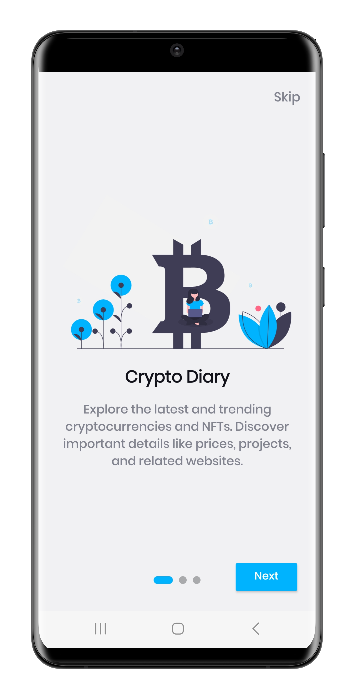

<a href="https://www.isseverapps.com">
  

    
  

</a>

<h1 align="center">CryptoDiary: Modern Android Application</h1>

CryptoDiary is an Android application designed to view and track information about cryptocurrencies. This project is created with the purpose of learning and experimenting with new technologies. It's a live project where new and best practices are continuously researched and integrated.

<h2 align="center">App Screenshots</h2>

  <b>Light Theme</b> 
  
  
  
  
  
  

  <b>Dark Theme</b> 
  
  
  
  
  
  

## Technologies and practices utilized:

- [**Kotlin:**](https://kotlinlang.org/) The app is written in Kotlin, a modern and safe language.

- [**MVVM (Model-View-ViewModel):**](https://developer.android.com/jetpack/guide) It uses the MVVM architectural pattern to ensure clean architecture and easy testability.

- [**Android Jetpack:**](https://developer.android.com/jetpack) The app makes use of Android Jetpack, a suite of libraries and tools designed to overcome the challenges of modern Android development.

- [**Hilt-Dagger:**](https://dagger.dev/hilt/) Hilt-Dagger is used as the Dependency Injection (DI) solution.

- [**LiveData:**](https://developer.android.com/topic/libraries/architecture/livedata) LiveData is used to observe data changes and automatically update the UI.

- [**Navigation Component:**](https://developer.android.com/guide/navigation) Navigation Component is used to manage navigations.

- [**Firebase:**](https://firebase.google.com/) Firebase is used for user sessions and synchronization of favorite cryptocurrencies.

- [**Retrofit:**](https://square.github.io/retrofit/) Retrofit is used to communicate with HTTP APIs.

- [**Moshi:**](https://github.com/square/moshi) Moshi is used to convert JSON data into Kotlin objects.

- [**Glide:**](https://github.com/bumptech/glide) Glide is used for network image loading and caching.

- [**Data Binding:**](https://developer.android.com/topic/libraries/data-binding) Data Binding is used to facilitate programmatic access to UI components.

- [**Kotlin Flow:**](https://kotlinlang.org/docs/flow.html) Kotlin Flow, which represents asynchronous data streams and works integrated with coroutines, is used.

The project's code is crafted with a focus on reusability, modularity, and minimizing code repetition throughout the entire development process. CryptoDiary is shared with the community with the aim of demonstrating modern and best practices in Android app development. 

Your feedback and contributions are valuable. Happy coding!

---

  <b>Made with ❤️ by Muhammed Issever</b> 
  <a href="mailto:muhammed@issever.co">muhammed@issever.co</a> |
  <a href="mailto:isseverdev@gmail.com">isseverdev@gmail.com</a> 
  

